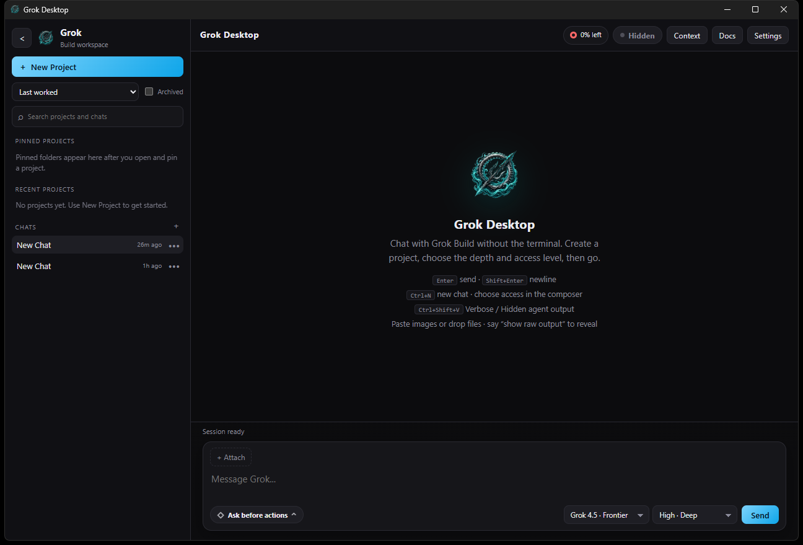

# Grok Desktop

Lightweight desktop GUI for the **Grok Build** CLI — Codex-inspired dark UI, project workspaces, explicit reasoning/access controls, rich file drop, system tray, chat history, and Grok CLI context visibility.

**Current version:** 0.4.0
**Stack:** Tauri 2 (Rust) + Svelte 5 (SvelteKit SPA)  
**Platform:** Windows 10/11 primary (macOS/Linux later)

---

## Screenshots



More screenshots: [docs/SCREENSHOTS.md](docs/SCREENSHOTS.md)

---

## Requirements

| Tool                               | Notes                                                |
| ---------------------------------- | ---------------------------------------------------- |
| [Rust](https://rustup.rs/) stable  | `rustc`, `cargo`                                     |
| Node.js 18+                        | npm included                                         |
| [Grok Build CLI](https://grok.com) | `grok` on PATH or `%USERPROFILE%\.grok\bin\grok.exe` |
| WebView2                           | Windows; installer can bootstrap                     |

Verify:

```powershell
rustc --version
cargo --version
node --version
grok --version
```

---

## Build & run

### Launch (stable — recommended)

Use the launcher or `npm start` so Tauri builds the production context and embeds `build\`.  
Do not launch a raw Cargo-built exe for normal use; it can load the dev URL or miss embedded assets.

Double-click **`Grok-Desktop.bat`** or:

```powershell
cd "F:\Grok Gui\grok-desktop"
npm install
npm start
```

That runs **`npx tauri build --no-bundle --ci`** and starts  
`src-tauri\target\release\grok-desktop.exe` (loads `build\` offline — **no port 1420**).  
First release compile can take several minutes; leave the console open until it finishes.

### Hot-reload development (optional)

```powershell
npm run start:dev
```

Starts Vite **and** the app together. Leave that console open.

### Production installer

```powershell
npm run tauri:build
```

Artifacts: `src-tauri/target/release/bundle/` (MSI / NSIS as configured).

For the normal Windows experience, run the NSIS `Grok Desktop_*_x64-setup.exe` package. It installs for the current user, creates Start Menu and desktop shortcuts, and uses the Kraken icon for the app, taskbar, tray, installer, and shortcuts.

Or double-click `Grok-Desktop.bat` after a release binary exists.

### Pre-release polish (CI-style)

```powershell
npm run polish
```

Runs: `cargo fmt`, `cargo clippy --all-targets -- -D warnings`, `npm run lint` (check + prettier), `npm run build`.

Individual gates:

```powershell
cd src-tauri
cargo fmt --all
cargo clippy --all-targets -- -D warnings
cd ..
npm run check
npm run format
npm run build
```

---

## First run

1. `grok --version` works in a terminal
2. `grok login` if not authenticated
3. Open Grok Desktop → **New Project** → create a new project or use an existing folder
4. Choose reasoning depth and an approval profile in the composer, then send a message
5. Closing the window **hides to tray** — use tray **Quit Grok Desktop** to exit

---

## Features

| Feature            | Behavior                                                                                                                          |
| ------------------ | --------------------------------------------------------------------------------------------------------------------------------- |
| Chat               | Headless turns: `grok -p ... -m ... --cwd ... --output-format plain`                                                              |
| Approval           | Ask before actions, auto-approve edits, plan only, or full-access (`--always-approve`) profiles                                   |
| Reasoning          | Low, medium, or high reasoning effort next to the model selector                                                                  |
| Agent Transparency | **Default Hidden** (status only). **Verbose** streams raw output. Per-message “Show agent details”; say “show raw output”         |
| Attachments        | Paste images or drop/select images, video, audio, documents, code, and archives; managed local copies, previews, 16/file turn cap |
| Usage              | Allocation remaining, reset time, prepaid credits, and on-demand spend from Grok CLI billing telemetry                            |
| Projects           | Create a new project folder or open an existing one; session cwd follows the selected project                                     |
| History            | Per-chat JSON under app data; last chat restored on launch                                                                        |
| Search             | Filter projects and chats from one sidebar field; `Ctrl+K` focuses it                                                             |
| Transcript tools   | Export any chat as Markdown; copy answers or code blocks; retry prior user messages                                               |
| CLI Context        | Context panel shows Grok CLI capabilities, recent CLI sessions, tracked worktrees, MCP servers, and plugins                       |
| Tray               | Show/hide, New Chat, Toggle YOLO, Quit                                                                                            |
| Documentation      | In-app Docs modal with quick start, troubleshooting, and roadmap notes                                                            |
| Shortcuts          | `Ctrl+K` search · `Ctrl+N` new chat · `Ctrl+Shift+Y` YOLO · `Ctrl+Shift+V` Verbose · `Ctrl+,` settings · `F1` docs                |

Browser-capable MCP servers such as Playwright can be detected and shown when Grok reports them, but Grok Desktop does not yet include an embedded browser panel or first-class browser automation UI.

---

## Documentation

- [Architecture](docs/ARCHITECTURE.md)
- [Roadmap](docs/ROADMAP.md)
- [Screenshots](docs/SCREENSHOTS.md)
- [Contributing](CONTRIBUTING.md)
- [Security](SECURITY.md)
- [Changelog](CHANGELOG.md)

---

## App data

`%APPDATA%\com.the-kraken.grok-desktop\`

| Path            | Purpose                                             |
| --------------- | --------------------------------------------------- |
| `settings.json` | Model, reasoning, approval, output, and UI defaults |
| `projects.json` | Pinned/recent projects                              |
| `chats/*.json`  | Chat history (plaintext)                            |
| `temp_images/`  | Managed message attachments (legacy directory name) |

---

## Security notes (local app)

- Grok is spawned with discrete argv (no shell) — no classic command injection.
- Image paths attached to prompts must live under managed `temp_images/`.
- Grok binary override must be named `grok` / `grok.exe`.
- Chat/project IDs are UUID-shaped (path traversal hardened).
- Chat history is **local plaintext** — treat the machine as trusted.
- System tray close hides the window; full quit is via tray menu.

---

## Known limitations

1. **Legacy chat continuity:** chats first used before v0.2.0's deterministic session mapping retain their UI history, but their earlier anonymous CLI context cannot be recovered automatically. New turns use the chat UUID as the Grok session ID and resume it deterministically.
2. **Stop on non-Windows platforms** currently targets the main `grok` process. Windows builds contain each turn in a kill-on-close Job Object so child tools are terminated with it.
3. **Headless mode** (`-p`) is not a full interactive TUI — no live ACP framing for plan mode widgets yet.
4. **Theme** is dark-only (setting reserved for later).
5. **Browser automation UI** is not implemented yet. Browser/Playwright MCPs may be visible in Context, but there is no embedded browser surface.
6. Tray may be unavailable in headless/CI environments — the main window still works.

---

## Project layout

```
grok-desktop/
├── docs/             # Architecture, roadmap, screenshots
├── src-tauri/src/     # Rust: commands, config, grok_process, image_handler, tray
├── src/lib/           # Svelte components + stores
├── src/routes/        # App shell
├── Grok-Desktop.bat   # Launcher helper
└── package.json
```

---

## Troubleshooting

| Symptom                    | What to try                                                                                  |
| -------------------------- | -------------------------------------------------------------------------------------------- |
| “Grok CLI not found”       | Install Grok Build; open a new terminal; or set binary in Settings to `…\.grok\bin\grok.exe` |
| Auth / empty replies       | Run `grok login`, then retry                                                                 |
| Project folder errors      | Re-open the project; ensure the path still exists                                            |
| Image attach fails         | Use ≤20 MB PNG/JPEG/GIF/WebP/BMP; paste from clipboard                                       |
| Window disappeared         | Check the system tray; left-click the Grok Desktop icon                                      |
| `tauri dev` never opens    | Stale Vite often holds **port 1420** (`strictPort`). Use `npm start` / `Grok-Desktop.bat`    |
| Blank / no window in dev   | Run `npm start` (frees 1420, visible console). Or `npm run start:bin` after `npm run build`  |
| Enable frontend debug logs | DevTools: `localStorage.setItem('grok-desktop-debug','1')` then reload                       |

---

## License

MIT
