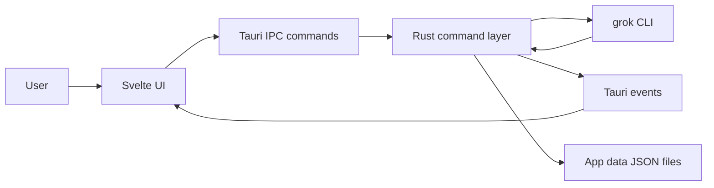

# Architecture

Grok Desktop is a local desktop shell around the Grok Build CLI.

## Stack

- Tauri 2 hosts the native desktop window, tray, file dialogs, and Rust command layer.
- Svelte 5 renders the chat UI, sidebar, parallel-agent workspace, settings, docs, and context panels.
- Grok Build CLI is spawned by Rust for each headless chat turn.

## Data Flow



## Main Modules

| Area                         | Files                                                          |
| ---------------------------- | -------------------------------------------------------------- |
| App shell                    | `src/routes`, `src/lib/components`                             |
| Chat state                   | `src/lib/stores/chat.ts`                                       |
| Project state                | `src/lib/stores/projects.ts`                                   |
| Settings and capabilities    | `src/lib/stores/settings.ts`, `src/lib/stores/capabilities.ts` |
| Parallel agent state         | `src/lib/stores/agents.ts`                                     |
| Desktop and CLI updates      | `src/lib/stores/updater.ts`, `src-tauri/src/grok_cli.rs`       |
| Privacy audit state          | `src/lib/stores/privacy.ts`                                    |
| Tauri command bridge         | `src-tauri/src/commands.rs`                                    |
| Grok process execution       | `src-tauri/src/grok_process.rs`                                |
| Grok inventory/context       | `src-tauri/src/capabilities.rs`, `src-tauri/src/grok_cli.rs`   |
| Parallel agent execution     | `src-tauri/src/agent_runs.rs`                                  |
| Privacy audit and safeguards | `src-tauri/src/privacy.rs`                                     |
| Local config and persistence | `src-tauri/src/config.rs`                                      |
| Images                       | `src-tauri/src/image_handler.rs`                               |
| Tray                         | `src-tauri/src/tray.rs`                                        |

## Chat Execution

Each turn currently runs a bounded headless command:

```text
grok -p <prompt> -m <model> --reasoning-effort <level> --cwd <project> --output-format plain
```

The app streams stdout/stderr to the frontend, keeps Hidden mode clean by default, and stores raw output for explicit reveal.

## Parallel Agents

The Agents workspace asks `grok inspect --json` for the effective built-in, project, user, and plugin agent inventory. Each dispatched task receives a unique Grok session ID and runs independently with the selected agent and current project settings. Runs continue while their tabs are not selected and can be stopped individually.

Project definitions are stored in `<project>/.grok/agents/*.md`; user definitions are stored in `~/.grok/agents/*.md`. Names are constrained to path-safe characters, files are created exclusively, and the app allows at most eight concurrent runs.

## Updates

The Tauri updater checks the latest GitHub Release after startup, then every six hours, or on demand. Published artifacts are signed in CI. The app embeds only the public verification key, prompts before installation, and restarts after a verified update finishes.

Grok CLI updates remain a separate official channel. Grok Desktop calls `grok update --check --json` for machine-readable installed/latest status and invokes `grok update` only after a second installation confirmation. Installation is blocked while chat or agent tasks are active and runs without a console window.

At startup, the usage meter launches a hidden, prompt-free Grok session only long enough for the CLI to publish a fresh billing snapshot, then terminates the contained process tree. It does not send a model prompt or create a chat session. If no fresh snapshot arrives, the UI reports usage as unavailable rather than showing stale numeric allocation.

## Privacy Guard

Privacy Guard applies telemetry-off environment variables to chat and parallel-agent processes. It tails Grok's local unified log from the task's start position; if a repository-state upload event appears, the app terminates the contained Grok process tree and raises a visible privacy alert. The Privacy Center audits historical local evidence, can write equivalent persistent CLI settings after creating a backup, and warns before unusually broad project roots are opened.

Account-level retention changes use Grok Build's own `/privacy opt-out` and `/privacy opt-in` flows in a hidden, contained CLI process. The UI and backend require an exact direction-specific typed confirmation, wait for Grok's authenticated account cache to report the requested state, and terminate the helper process on success or timeout.

## App Data

The app writes user data under `%APPDATA%\com.the-kraken.grok-desktop\`:

- `settings.json`
- `projects.json`
- `chats/*.json`
- `temp_images/`

## Planned Performance Direction

The main performance limitation is process-per-turn startup. The intended upgrade path is a persistent Grok transport such as `grok agent stdio`, `grok agent serve`, or leader mode.

## Browser Automation

The Context panel can show browser-capable MCP servers when Grok reports them, for example Playwright-backed servers. The current app does not embed a browser view or expose browser-specific controls; those are roadmap items.
