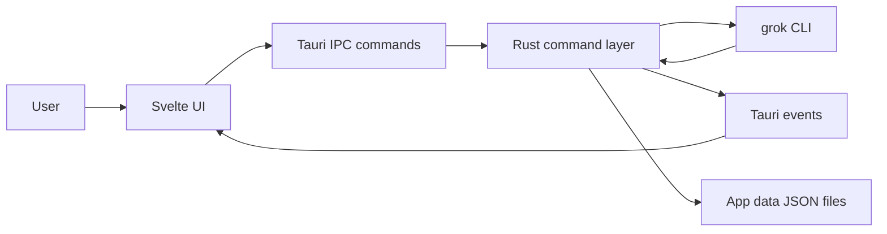

# Architecture

Grok Desktop is a local desktop shell around the Grok Build CLI.

## Stack

- Tauri 2 hosts the native desktop window, tray, file dialogs, and Rust command layer.
- Svelte 5 renders the chat UI, sidebar, settings, docs, and context panels.
- Grok Build CLI is spawned by Rust for each headless chat turn.

## Data Flow



## Main Modules

| Area | Files |
| ---- | ----- |
| App shell | `src/routes`, `src/lib/components` |
| Chat state | `src/lib/stores/chat.ts` |
| Project state | `src/lib/stores/projects.ts` |
| Settings and capabilities | `src/lib/stores/settings.ts`, `src/lib/stores/capabilities.ts` |
| Tauri command bridge | `src-tauri/src/commands.rs` |
| Grok process execution | `src-tauri/src/grok_process.rs` |
| Grok inventory/context | `src-tauri/src/capabilities.rs`, `src-tauri/src/grok_cli.rs` |
| Local config and persistence | `src-tauri/src/config.rs` |
| Images | `src-tauri/src/image_handler.rs` |
| Tray | `src-tauri/src/tray.rs` |

## Chat Execution

Each turn currently runs a bounded headless command:

```text
grok -p <prompt> -m <model> --cwd <project> --output-format plain
```

The app streams stdout/stderr to the frontend, keeps Hidden mode clean by default, and stores raw output for explicit reveal.

## App Data

The app writes user data under `%APPDATA%\com.the-kraken.grok-desktop\`:

- `settings.json`
- `projects.json`
- `chats/*.json`
- `temp_images/`

## Planned Performance Direction

The main performance limitation is process-per-turn startup. The intended upgrade path is a persistent Grok transport such as `grok agent stdio`, `grok agent serve`, or leader mode.

## Browser Automation

The Context panel can show browser-capable MCP servers when Grok reports them, for example Playwright-backed servers. The current app does not embed a browser view or expose browser-specific controls; those are roadmap items.
